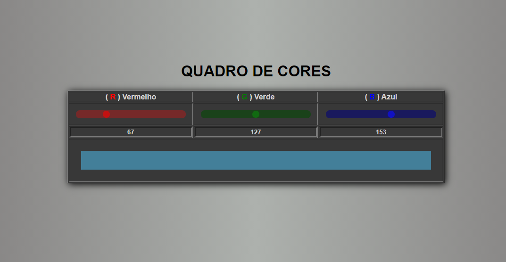

# Quadro de cores

## Demonstration

Para visualizar o projeto funcionando [clica aqui](https://douglassantos-code.github.io/quadro-cores/).

## Techs

* [ ] HTML
* [ ] CSS
* [ ] Java Script

## Author

**Douglas D. Santos**

Encontre-me em [?&style=for-the-badge&logo=gmail&logoColor=white)](mailto:douglas.d.santos.dev@gmail.com) [.svg?&style=for-the-badge&logo=linkedin&logoColor=white)](https://www.linkedin.com/in/douglas-santos-8442b41ba/)

## Licença

 

Esse projeto está sob a licença MIT. Veja o arquivo [LICENSE](https://github.com/DouglasSantos-code/quadro-cores/blob/main/LICENSE) para mais detalhes.